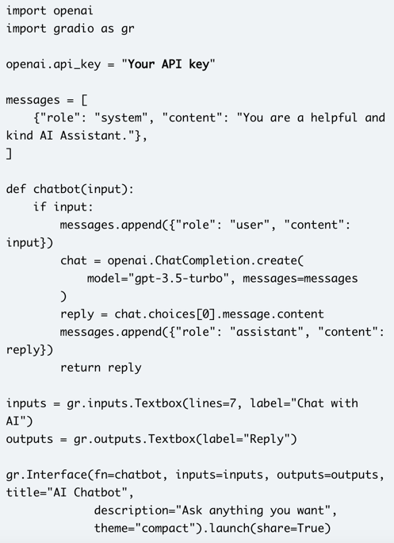
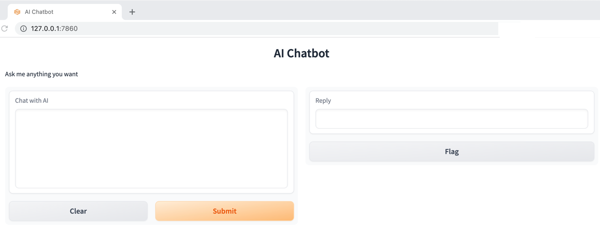

# AI ChatBot

## Installation

### Prerequisites
### How to set up your Mac to Create an AI Chatbot
There are a couple of tools you need to set up the environment before you can create an AI chatbot powered by ChatGPT. To briefly add, you will need Python, Pip, OpenAI, and Gradio libraries, an OpenAI API key, and a code editor like Notepad++, or Sublime Text.

Step1: `pip install openai`  

FYI: This allow you to interact with ChatGPT through their API.

Step2: `pip install gradio` 

FYI: Gradio allows you to quickly develop a friendly web interface so that you can demo your AI chatbot. It also lets you easily share the chatbot on the internet through a shareable link. However, you  will need to keep the server running on your local machine when you share the link.

Step3: Download Notepad++ or Sublime Text.

Step4: Copy and paste the following in a file, I called mine: "app.py"

Step5: Launch "Terminal" on your Mac

Step6: Execute the following command to upgrade 'pip'
`python -m pip install -U pip`

Step7: If you don't already have an OpenAI key, you can obtain a free one. The API key will allow you to call ChatGPT in your own interface and display the results right there. Currently, OpenAI is offering free API keys with $5 worth of free credit for the first three months. If you created your OpenAI account earlier, you may have free credit worth $18. After the free credit is exhausted, you will have to pay for the API access. But for now, it’s available to all free users.

Step8: Launch a browser at https://platform.openai.com/signup

Step9: Copy and paste the following code into our favorite editor.

Step10: Save the file, i.e., "app.py"

Step11: Copy the path/directory of the "app.py" file

Step12: Execute the following in Terminal:
`python <path to your app.py file>` and hit <Enter>

Step13: Copy the URL in a browser, and don't worry about the errors.
`https://127.0.0.1:7860`

You should see this: 